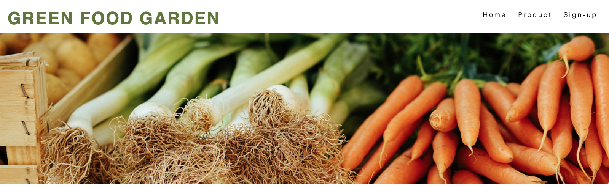
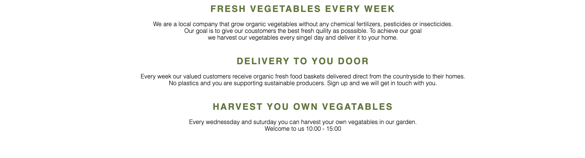
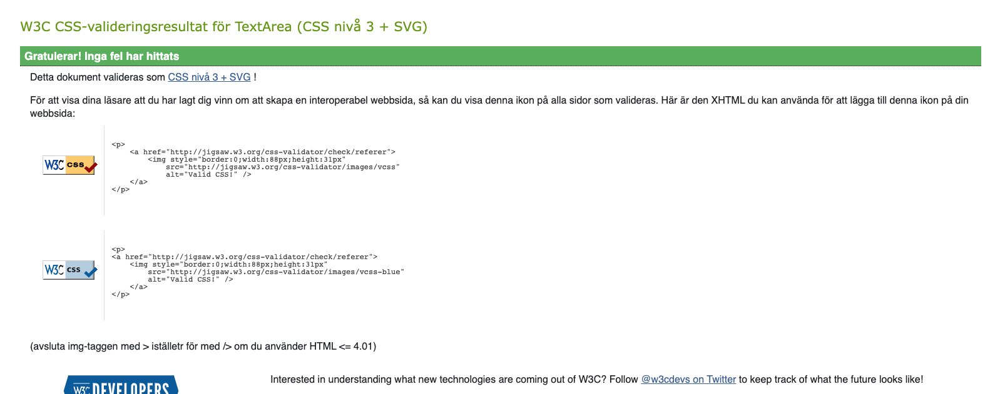

1. About
2. Users Experience (UX)
3. Features
4. Technologies Used
5. Troubleshooting
6. Testing
7. Debugging
8. Deployment
9. Credits

 # 1. About

 Green Food Garden are a local company that grow organic vegetables without any chemical fertilizers, pesticides or insecticides.
Our goal is to give our coustomers the best fresh quility as posssible and deliver to there home weekly.

Green Food Garden doesnt excist in real life this is just a idea for my Milestone project 1 for the full stack web development course at code institute. All truogh the greenhouse does excist and its my family farm and we only grew cucumbers. 

[Live project website can be accesed here.](https://kharriitd.github.io/ms_project_html-css/)

[Repository for this project here](https://github.com/kharriiTD/ms_project_html-css)

## 2.1 Users Experience (UX)
As a user I want to be able to navigate through the whole site smoothly. 
As a user I want to easily be able to contact
As a user I want to know price 
As a use I want to know if i can cancel the order
As a use i want to know what i get in the basket

 ## 2.2 Wireframes

 sätter in imorgon

## Existing Features

- Navigation Bar

   - Featured on all three pages, the full responsive navigation bar includes links to the Logo, Home page, Gallery and Sign Up page and is identical in each page to allow for easy navigation.

  - This section will allow the user to easily navigate from page to page across all devices without having to revert back to the previous page via the ‘back’ button.

## Home content

  - The home content show company information and what there goals are. Also show that the coustomers can pick basket and harvest vegetables. 

## Footer
Footer have links to social media. Each link i

**I start here**

Choose heading color #5f7738 and text color black. 
i use some code  to make social link from love runnig projekt
color nav #d4d7af
reference:
picture and insperation from 
http://www.odlarlaget.se/sv/produkter/maanader/mars
bild veg basket
https://www.google.com/imgres?imgurl=https%3A%2F%2Fpreviews.123rf.com%2Fimages%2Fjinga%2Fjinga1306%2Fjinga130600040%2F20337318-verdure-fresche-in-cestino-isolato-su-bianco.jpg&imgrefurl=https%3A%2F%2Fwww.123rf.com%2Fphoto_20337318_fresh-vegetables-in-basket-isolated-on-white.html&tbnid=UsiTB5dEEiZFrM&vet=12ahUKEwjUlOTfgKj2AhUhgv0HHcSBC-MQMygCegUIARCtAg..i&docid=JqTCOjO-Ch7cPM&w=1300&h=866&q=vegetables%20basket&ved=2ahUKEwjUlOTfgKj2AhUhgv0HHcSBC-MQMygCegUIARCtAg

## Validator Testing

http://jigsaw.w3.org/css-validator/check/referer (HTML / XML documents only)

https://www.organicbasketbarcelona.com/en