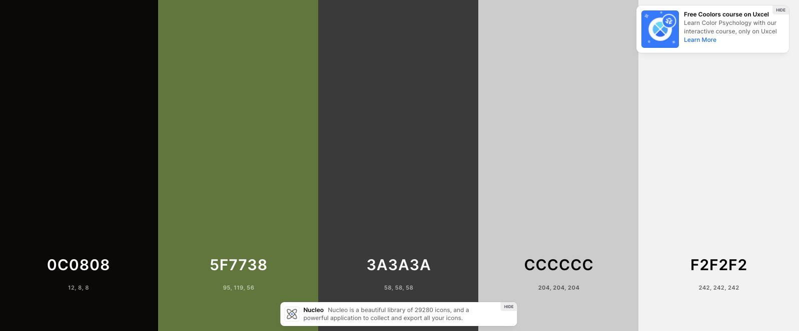
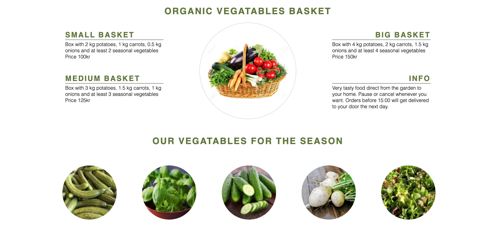

1. About
2. Users Experience (UX)
3. Features
4. Technologies Used

 # 1. About

 Green Food Garden are a local company that grow organic vegetables without any chemical fertilizers, pesticides or insecticides.
Our goal is to give our coustomers the best fresh quility as posssible and deliver to their home weekly.

Green Food Garden doesnt excist in real life this is just a idea for my Milestone project 1 for the full stack web development course at code institute. All trough the greenhouse does excist and its my family farm and we only grew cucumbers. 

[Live project website can be accesed here.](https://kharriitd.github.io/ms_project_html-css/)

[Repository for this project here](https://github.com/kharriiTD/ms_project_html-css)

# 2.  Users Experience (UX)
- As a user I want to be able to navigate through the whole site smoothly. 
- As a user I want to easily be able to contact.
- As a user I want to know price.
- As a use I want to know if i can cancel the order.
- As a use i want to know what i get in the vegetables basket.

 ## Wireframes

 sätter in imorgon.

 ## Structure
 Three different pages with home, product and sign up.
 The structure should be easy to understand and navigate. 
 There are a navbar, hero image on the top of the header for each page and a footer with social media.

 # Design Choices

- ## Typography
I chose one that was most readable in my opinion. 
Toboto-serif for the headlines
Open-sansa for body text structure and sans-serif as a alternativ just in case thoose others fails.

- ## Color Scheme
The color I use to this project. 

# Existing Features

## Navigation Bar

   - Featured on all three pages, the full responsive navigation bar includes links to the Logo, Home page, Gallery and Sign Up page and is identical in each page to allow for easy navigation.

  - This section will allow the user to easily navigate from page to page across all devices without having to revert back to the previous page via the ‘back’ button.

## Home content

  - The home content shows the company information, their goals and times to harvest their own vegetables and delivery offers. 

## The footer

  - The footer section includes links to the relevant social media sites for Green Food Garden. The links will open to a new tab to allow easy navigation for the user.
  
  - The footer is valuable to the user as it encourages them to keep connected via social media

## Product page 
  
  - This section is valuable to the user as they can see each basket have to offer and price. 

- Gallery will allow users to see all the season vegetables.

## The Sign Up Page

 - This page will allow the user to get signed up for there weekly vegetables basket. The user will be able specify if they want smal, medium or big basket. The user will be asked to submit their full name and email address. They will be able to write what they want for season vegetables.

 - In this page the user can find opening hours, adress and also a map. 

# Features Left to Implement
 - I would like to add name under each image on product gallery page.
 - Add a new page with delivery and order information. 

# Technologies Used
- HTML5 - provides the content and structure for the website.
- CSS - provides the styling.
- Balsamiq - used to create the wireframes.
- Gitpod - used to deploy the website.
- Github - used to host and edit the website.
- Font Awesome - Use to import social media links.
- colors.co - used to color scheme.
- Am I responsive? - used to check responsivity of code and display the mock up in the documentation.
- W3C Markup Validation Service - used to validate HTML codes.
- W3C CSS Validation service - used to validate CSS codes.
- Chrome Devtools - used throughout the project to inspect on elements and writing codes.

## Validator Testing

 # 8. Deployment 

## To deploy the project

The site was deployed to GitHub pages. The steps to deploy a site are as follows:

   - In the GitHub repository, navigate to the Settings tab
   - From the source section drop-down menu, select the Master Branch
   - Once the master branch has been selected, the page will be automatically refreshed with a detailed ribbon display to indicate the successful deployment.

# Credits
To code institue for header and footer i use on love running project. 

I got help from Tutor Assistance with my contact form 

# Content 
I toke a few part of the content from 
https://www.organicbasketbarcelona.com/en

The rest of content was written by me. 

# Media

The images used for the gallery page were taken from this 
http://www.odlarlaget.se/sv/produkter/maanader/mars

https://www.google.com/imgres?imgurl=https%3A%2F%2Fpreviews.123rf.com%2Fimages%2Fjinga%2Fjinga1306%2Fjinga130600040%2F20337318-verdure-fresche-in-cestino-isolato-su-bianco.jpg&imgrefurl=https%3A%2F%2Fwww.123rf.com%2Fphoto_20337318_fresh-vegetables-in-basket-isolated-on-white.html&tbnid=UsiTB5dEEiZFrM&vet=12ahUKEwjUlOTfgKj2AhUhgv0HHcSBC-MQMygCegUIARCtAg..i&docid=JqTCOjO-Ch7cPM&w=1300&h=866&q=vegetables%20basket&ved=2ahUKEwjUlOTfgKj2AhUhgv0HHcSBC-MQMygCegUIARCtAg

**I start here**

Choose heading color #5f7738 and text color black. 
i use some code  to make social link from love runnig projekt
color nav #d4d7af
reference: